# FishPi Golang Client

一个喜欢造轮子的垃圾`码字🐒`写的适用于[摸鱼派](https://fishpi.cn)聊天室的项目。

## 项目规划

   - [x] 聊天消息
   - [x] 领取红包
   - [x] 查询活跃度
   - [x] 领取昨日活跃奖励
   - [x] 获取用户信息
   - [x] 撤回消息指令
   - [ ] 连接WS显示历史消息
   - [ ] 获取用户主页信息
   - [x] 撤回消息解析
   - [x] 复读机
   - [ ] 发送红包

## 更新记录

   2022-08-24 撤回消息、撤回消息解析、复读机
   2022-08-19 初版从个人版中重构诞生

## 使用方法

### 初始化

1. 从[releases](https://github.com/fghwett/fishpi-golang/releases/)下载适合自己平台的客户端，并解压。

    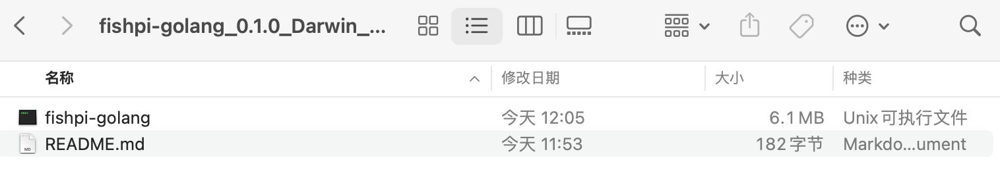

2. 创建配置文件[config.yml](https://github.com/fghwett/fishpi-golang/raw/main/config.yml)并根据自己的需求更改配置

    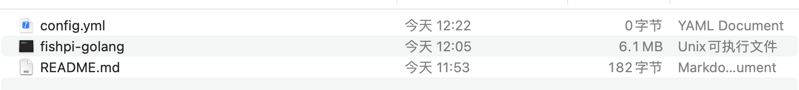

3. 登录账号

   ```shell
   ./fishpi-golang -conf="config.yml" -login   
   ```

4. 在你想要的终端运行接收消息端

   ```shell
   ./fishpi-golang -conf="config.yml" -ws
   ```

5. 终端分屏并运行消息发送端

   ```shell
   ./fishpi-golang -conf="config.yml" -msg
   ```

   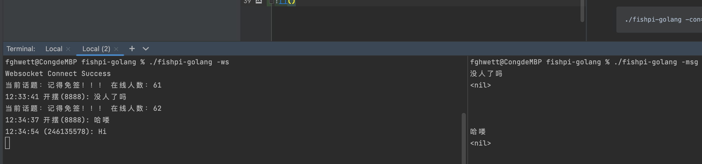

> 左边为接收端 右边为发送端 通过调节状态栏高度可以隐藏自己发送的消息

### 发送端的一些小指令

`help` - *帮助指令* 查看帮助信息

   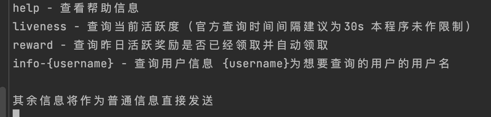
   
`liveness` *查询当前活跃度* 官方查询时间间隔建议为30s 脚本为一分钟 本程序未做限制 请酌情使用（后续会更改逻辑 增加自从提醒功能）

   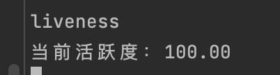

`reward` *领取昨日活跃奖励*

   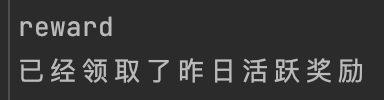

`info-{username}` *查询用户信息* {username}为想要查询的用户名

   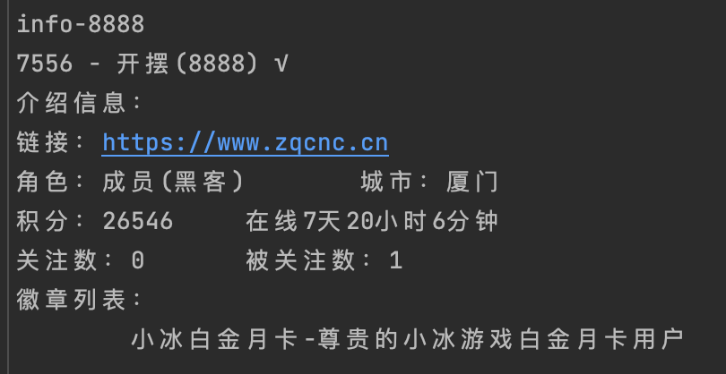
   
### 接收端的小指令

目前只做了抢红包功能的一些映射，`0`-普通红包(拼手气 平分) `1-3`猜拳红包 `4`-心跳红包 `5`-专属红包

   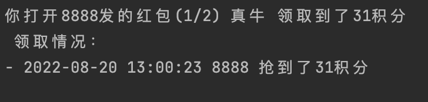

### 一些小优化

目前只做了一些我认为影响的改动，如果你有其他需求或者建议，欢迎提issue或者pr。

#### 天气消息解析

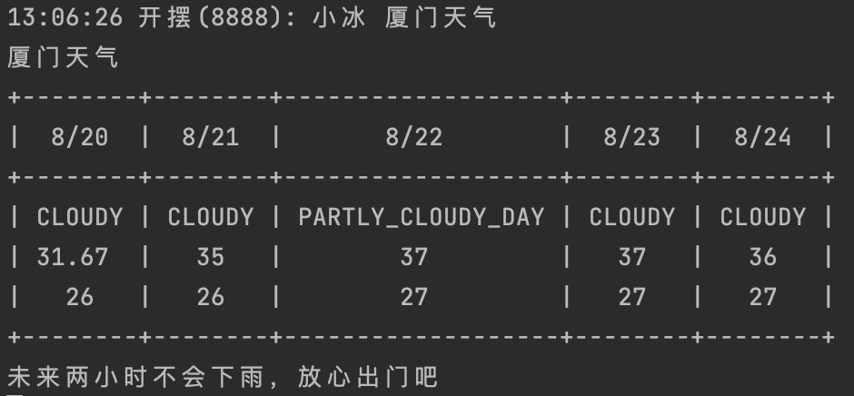

#### 小尾巴去除

网页版显示效果：

   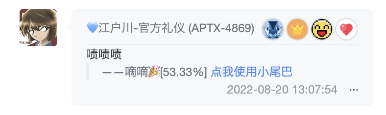

终端显示效果：

   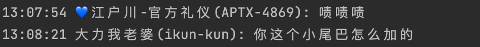
   
